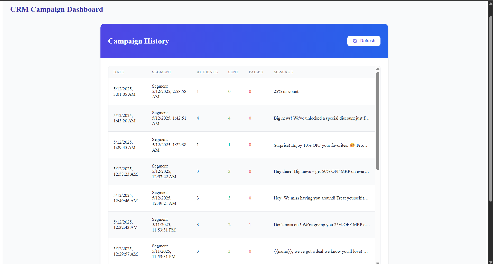

# CRM Campaign Platform

A modern CRM platform that helps businesses create targeted customer segments and manage marketing campaigns effectively. The platform uses AI to suggest campaign messages and provides real-time customer segmentation capabilities.

## Architecture


### Components
- **Frontend**: React-based SPA with modern UI components
- **Backend**: Express.js REST API
- **Database**: MongoDB for persistent storage
- **Cache**: Redis for real-time data and pub/sub
- **AI**: Google's Generative AI (Gemini) for campaign message suggestions
- **Auth**: Google OAuth for secure authentication

## Local Setup

### Prerequisites
- Node.js (v14 or higher)
- MongoDB
- Redis
- Google Cloud Platform account (for OAuth and AI)

### Environment Variables

Create `.env` files in both `client` and `server` directories:

**Server (.env)**
```
PORT=5000
MONGO_URI=mongodb://localhost:27017/crm-platform
REDIS_URL=redis://localhost:6379
GEMINI_API_KEY=your_gemini_api_key
```

**Client (.env)**
```
REACT_APP_GOOGLE_CLIENT_ID=your_google_client_id
```

### Installation

1. Clone the repository:
```bash
git clone https://github.com/jiya19g/CRM.git
cd CRM-platform
```

2. Install server dependencies:
```bash
cd server
npm install
```

3. Install client dependencies:
```bash
cd ../client
npm install
```

4. Start the development servers:

In the server directory:
```bash
npm start
```

In the client directory:
```bash
npm start
```

The application will be available at:
- Frontend: http://localhost:3000
- Backend: http://localhost:5000

## Technology Stack

### Frontend
- React 19
- React Router v7
- Google OAuth
- Tailwind CSS
- Axios

### Backend
- Express.js
- MongoDB with Mongoose
- Redis for real-time features
- Google Generative AI (Gemini)
- Joi for validation

### Development Tools
- Create React App
- PostCSS
- Autoprefixer
- Jest for testing

## Features

1. **Customer Segmentation**
   - Create custom segments based on multiple criteria
   - Real-time filtering and preview
   - Save and reuse segments

2. **Campaign Management**
   - AI-powered message suggestions
   - Campaign scheduling
   - Delivery tracking
   - Performance analytics

3. **Authentication**
   - Secure Google OAuth integration
   - Protected routes
   - Session management

## Known Limitations

1. **Data Scale**
   - The current implementation is optimized for small to medium-sized customer databases
   - Large-scale segmentation might require pagination implementation

2. **AI Suggestions**
   - Message suggestions are limited to English
   - Response time depends on Google AI API availability

3. **Real-time Features**
   - Redis pub/sub is used for real-time updates but requires Redis server to be running
   - WebSocket implementation might be needed for production-scale real-time features

## Assumptions

1. **Customer Data**
   - Customer data is assumed to be pre-populated in the database
   - Basic customer attributes (name, email, spend, visits) are required

2. **Authentication**
   - Google OAuth is the only authentication method
   - Users must have a Google account to access the platform

3. **Campaign Delivery**
   - Campaign delivery mechanism is not implemented
   - Focus is on segment creation and campaign message management

## Screenshots

Here are some screenshots of the CRM Campaign Platform in action:




## Contributing

1. Fork the repository
2. Create your feature branch (`git checkout -b feature/AmazingFeature`)
3. Commit your changes (`git commit -m 'Add some AmazingFeature'`)
4. Push to the branch (`git push origin feature/AmazingFeature`)
5. Open a Pull Request

## License

This project is licensed under the MIT License - see the LICENSE file for details.
